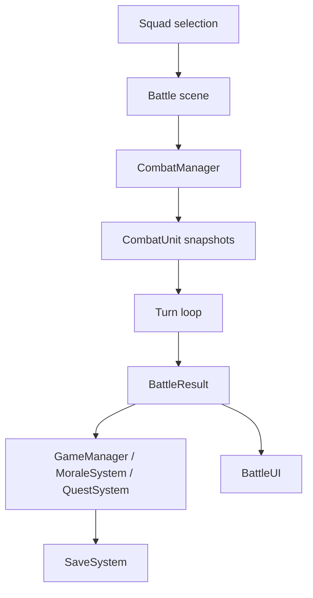

# COMBAT_SYSTEM.md

## Purpose
Handles tower battle simulation, turn order, attack resolution, skill casting, and end-of-battle results.

## Main Scripts
- `Assets/Scripts/CombatManager.cs`
- `Assets/Scripts/CombatSkillEvaluator.cs`
- `Assets/Scripts/TraitSystem.cs`
- `Assets/Scripts/TowerFloor.cs`
- `Assets/Scripts/EnemyData.cs`
- `Assets/Scripts/SkillData.cs`
- `Assets/Scripts/SkillInstance.cs`
- `Assets/Scripts/UI/BattleUI.cs`

## Dependencies
- `GameManager` for squad, resources, roster updates, and post-battle persistence
- `MoraleSystem` for morale penalties and recovery
- `QuestSystem` for battle progress tracking
- `AudioManager` for attack and death SFX
- `SceneLoader` for battle scene entry and exit
- `HeroInstance` and `CombatUnit` for runtime unit state

## Data Flow

## Runtime Lifecycle
1. Battle scene loads
2. UI selects squad and floor
3. `CombatManager.StartBattle` builds runtime combat units
4. Turn loop resolves attacks or skills
5. Death handling and low-HP warnings fire events
6. End battle compiles `BattleResult`
7. Managers apply rewards, morale, quests, and save state

## Related Managers
- `GameManager`
- `MoraleSystem`
- `QuestSystem`
- `AudioManager`
- `SceneLoader`

## Common Bugs
- Skill IDs in `CombatSkillEvaluator` are hardcoded
- `CombatUnit` is a snapshot, so hero changes made mid-battle do not affect the source until battle end
- Target selection can break if lists are empty or the wrong side is passed in
- Scene-local battle state resets on scene reload

## Important Warnings
- Do not put save logic inside the battle loop
- Do not mutate `HeroData` during combat
- Use `CombatUnit` for battle math, not live hero objects
- Keep battle events small and deterministic

## AI Editing Precautions
- Read only the combat scripts and their direct dependencies unless the change requires another system
- If a new skill changes battle behavior, update `SKILL_SYSTEM.md` too
- If battle outcomes affect progress, update `SAVE_SYSTEM.md` or `TODO.md` as needed
- Prefer event additions over UI polling

## Future Expansion Plans
- Formation bonuses
- Status effects
- Encounter modifiers
- More enemy families and wave scripting
- Addressables-backed encounter content

