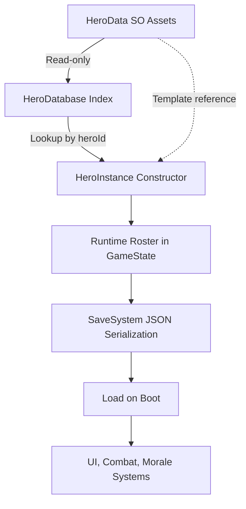

# HERO_SYSTEM.md

## Purpose
Defines the template-to-instance architecture for heroes. Separates immutable data definitions from mutable runtime state.

## Core Principle: Runtime/Template Separation
- **HeroData (ScriptableObject)** = Immutable template. Never modified at runtime. Source of base stats, class, traits, and scaling curves.
- **HeroInstance** = Mutable runtime state. Tracks HP, level, XP, morale, status, equipment, and battle history. Serialized to JSON for saves.
- **HeroDatabase** = Runtime lookup index. Maps stable `heroId` strings to `HeroData` templates. Not a source of truth.

## Architecture Diagram

## Component Responsibilities

### HeroData (Template)
- **Location:** `Assets/Resources/Heroes/SO_Hero_*.asset`
- **Type:** ScriptableObject (immutable at runtime)
- **Fields:**
  - Identity: `heroId`, `heroName`, `heroClass`, `starRating`
  - Stats: `baseStats` (hp, atk, def, spd), per-level scaling curves
  - Traits: `possibleTraits` list, `dropWeight` for gacha
  - Skills: `possessedSkillId` reference
- **Rules:** Never store runtime state here. Never mutate after load.

### HeroInstance (Runtime State)
- **Location:** Constructed by `GachaSystem`, stored in `GameState.roster`
- **Type:** Serializable C# class
- **Fields:**
  - Identity: `instanceId` (GUID), `heroDataId` (links to template)
  - Progression: `level`, `currentXP`, `xpToNextLevel`
  - Live Stats: `currentHP`, `maxHP`, `atk`, `def`, `spd`, `critChance`, STR/INT/AGI
  - Status: `morale`, `fatigue`, `HeroStatus` (Active/Fatigued/Wounded/Dead)
  - History: `missionsCompleted`, `kills`, `earnedTitle`, `battleLog`
  - Equipment: `equippedWeaponId`, `equippedArmorId`, `equippedRingId`
- **Methods:**
  - `RecalculateStats(HeroData)` — applies template + level + synthesis bonuses
  - `AddXP(amount, HeroData)` — handles leveling and stat recalculation
  - `ModifyMorale(delta)` — applies trait modifiers
  - `Die()` — marks hero as dead, records death info
- **Rules:** This is the only place for mutable hero state. Safe to serialize.

### HeroDatabase (Lookup Layer)
- **Location:** Built by `GameManager` at startup
- **Type:** Runtime registry class
- **Responsibilities:**
  - Index all `HeroData` assets by `heroId` and asset name
  - Provide `TryGet(heroId)` lookup for instance construction
  - Validate uniqueness of hero IDs
  - Support future JSON import pipeline
- **Rules:** Does not own data. Rebuildable from assets or JSON.

## Lifecycle Flow
1. **Boot:** `GameManager` loads `HeroData` assets → builds `HeroDatabase`
2. **Summon:** `GachaSystem` picks template → constructs `HeroInstance(template)`
3. **Roster:** Instance added to `GameState.roster` (List<HeroInstance>)
4. **Gameplay:** Combat, morale, quests mutate `HeroInstance` fields only
5. **Save:** `SaveSystem` serializes `HeroInstance` list to JSON
6. **Load:** JSON deserializes → instances restored → template re-linked via `heroDataId`

## Key Relationships
| Relationship | Direction | Notes |
|--------------|-----------|-------|
| HeroInstance → HeroData | Reference via `heroDataId` | Instance reads template, never writes |
| HeroInstance → GameState | Contained in `roster` list | GameState owns lifecycle |
| HeroDatabase → HeroData | Index mapping | Database is transient lookup cache |
| GameManager → HeroDatabase | Owner/builder | GameManager rebuilds on demand |

## Common Pitfalls
- ❌ Mutating `HeroData` at runtime (breaks template integrity)
- ❌ Storing scene object references in `HeroInstance` (breaks save/load)
- ❌ Using asset name instead of `heroId` for lookups (fragile under renaming)
- ❌ Duplicate `heroId` values (breaks database consistency)
- ❌ Calculating stats in multiple places (use `RecalculateStats` only)

## Files To Inspect
- `Assets/Scripts/HeroData.cs` — Template definition
- `Assets/Scripts/HeroInstance.cs` — Runtime state and methods
- `Assets/Scripts/HeroDatabase.cs` — Lookup index
- `Assets/Scripts/GameManager.cs` — Registry owner
- `Assets/Scripts/GachaSystem.cs` — Instance constructor caller
