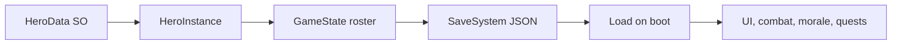

# HERO_SYSTEM.md

## Purpose
Defines the template hero data and the runtime hero instance model.

## Main Scripts
- `Assets/Scripts/HeroData.cs`
- `Assets/Scripts/HeroInstance.cs`
- `Assets/Scripts/HeroUtils.cs`
- `Assets/Scripts/GameManager.cs`

## Dependencies
- `SkillData` for skill links
- `GameManager` for hero registry and roster access
- `SaveSystem` for persistence
- `MoraleSystem` for morale and status transitions
- `TraitSystem` for trait effects in combat
- `Resources/Heroes` for current asset loading path

## Data Flow

## Runtime Lifecycle
1. `GameManager` loads hero templates
2. A summon creates a `HeroInstance`
3. The hero is added to the roster
4. Combat reads the runtime snapshot through `CombatUnit`
5. Leveling, morale, death, and titles mutate the instance
6. Save writes the instance back to JSON

## Related Managers
- `GameManager`
- `MoraleSystem`
- `FacilityManager`
- `QuestSystem`
- `CombatManager`
- `SynthesisSystem`

## Common Bugs
- Hero asset names and runtime IDs drift apart
- Missing `Resources/Heroes` assets break registry lookup
- Stat calculations are touched in more than one place
- Trait logic can be duplicated between combat and morale systems

## Important Warnings
- `HeroData` should stay read-only
- `HeroInstance` is the canonical place for mutable hero state
- Do not store scene object references on hero data or save state
- Do not add UI-only fields into the template asset unless they are true gameplay data

## AI Editing Precautions
- Read `HeroData`, `HeroInstance`, and the matching system doc before editing hero logic
- If a field changes here, update save data, UI display, and combat consumers together
- Prefer changing helper methods over rewriting raw stat math
- Do not rename hero IDs unless migration is planned

## Future Expansion Plans
- Equipment slots and loadout bonuses
- Affinity and relationship systems
- Hero branching evolutions
- Full addressable-backed hero content
- Duplicate conversion and shard systems

