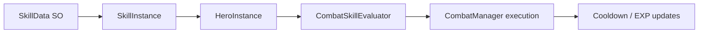

# SKILL_SYSTEM.md

## Purpose
Defines skill templates, runtime skill instances, combat casting rules, and skill leveling.

## Main Scripts
- `Assets/Scripts/SkillData.cs`
- `Assets/Scripts/SkillInstance.cs`
- `Assets/Scripts/CombatSkillEvaluator.cs`
- `Assets/Scripts/CombatManager.cs`
- `Assets/Scripts/HeroInstance.cs`

## Dependencies
- `GameManager`
- `HeroData`
- `CombatUnit`
- `Resources/Skills` for current skill lookup path

## Data Flow

## Runtime Lifecycle
1. A hero spawns with default class skills or unlocked skills
2. The runtime instance resolves `SkillData` by stable skill ID
3. Combat evaluates whether the skill should fire
4. Execution applies damage, healing, shields, or reactions
5. Used skills gain experience and cool down between turns

## Related Managers
- `CombatManager`
- `GameManager`
- `HeroInstance`
- `AudioManager`

## Common Bugs
- Missing `Resources/Skills` assets
- Hardcoded skill IDs in evaluators
- Skill instance data desync after renaming IDs
- Cooldown values not being restored the way the save/load flow expects

## Important Warnings
- `SkillData` is template data only
- `SkillInstance` should be the only mutable skill state holder
- Do not add scene references or UI references to skill templates
- Keep skill ID naming stable

## AI Editing Precautions
- If a new skill is added, update `SkillData`, `CombatSkillEvaluator`, and the relevant UI references together
- Only read combat scripts when a skill behavior issue is the target
- Keep skill balance data in the template asset where possible

## Future Expansion Plans
- Skill trees
- Passive and reaction tag expansion
- Skill inheritance and fusion
- Balance sheets imported from JSON
- Addressables-backed skill art and effect assets

