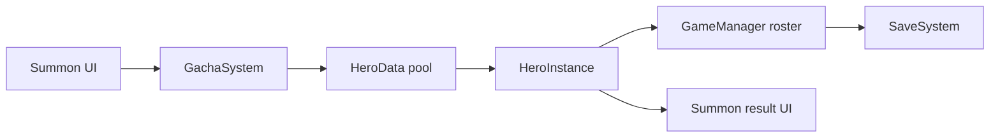

# SUMMON_SYSTEM.md

## Purpose
Handles gacha pulls, pity, summon costs, hero creation, and roster insertion.

## Main Scripts
- `Assets/Scripts/GachaSystem.cs`
- `Assets/Scripts/GameManager.cs`
- `Assets/Scripts/UI/SummonUI.cs`
- `Assets/Scripts/UI/HeroCardUI.cs`
- `Assets/Scripts/UI/GachaCardFlip.cs`

## Dependencies
- `HeroData` templates
- `GameManager` resource spending and roster mutation
- `SaveSystem` for persistence after summon results
- `AudioManager` for summon feedback

## Data Flow

## Runtime Lifecycle
1. Player opens the summon scene
2. UI reads available gem cost and pity state
3. `GachaSystem` rolls rarity and chooses a hero from the correct pool
4. `GameManager` adds the new hero to the roster
5. UI plays reveal and result animations
6. Save is written immediately

## Related Managers
- `GameManager`
- `AudioManager`
- `QuestSystem`
- `SceneLoader`

## Common Bugs
- Empty hero pools for a star tier cause null pulls
- Pity logic depends on the shared save state
- Cost mismatches can happen if UI text and `GachaSystem` constants drift
- Pull animation and data result can get out of sync if the UI is not event-driven

## Important Warnings
- Keep summon balance in one place
- Do not embed rarity logic in the UI
- Do not silently ignore failed pulls
- Keep the pity counter consistent across all summon entry points

## AI Editing Precautions
- Read only summon UI files plus `GachaSystem` unless the task touches hero templates or save state
- If summon output changes, verify roster save and quest tracking
- If pull cost or rarity rules change, update `PROJECT_MAP.md` and `MEMORY.md`

## Future Expansion Plans
- Featured banners
- Rate-up pools
- Duplicate conversion
- Multi-currency summon types
- Animated summon sequences with addressable assets

