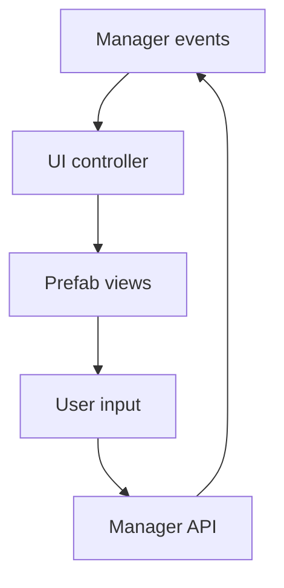

# UI_SYSTEM.md

## Purpose
Defines scene UI controllers, prefab usage, event subscriptions, and screen-to-manager boundaries.

## Main Scripts
- `Assets/Scripts/UI/LobbyUI.cs`
- `Assets/Scripts/UI/RosterUI.cs`
- `Assets/Scripts/UI/BattleUI.cs`
- `Assets/Scripts/UI/SummonUI.cs`
- `Assets/Scripts/UI/SquadFormationUI.cs`
- `Assets/Scripts/UI/SynthesisUI.cs`
- `Assets/Scripts/UI/MemorialUI.cs`
- `Assets/Scripts/UI/QuestUI.cs`
- `Assets/Scripts/UI/FacilityUI.cs`
- `Assets/Scripts/UI/DetailPanelUI.cs`
- `Assets/Scripts/UI/HeroCardUI.cs`
- `Assets/Scripts/UI/GearSlotUI.cs`
- `Assets/Scripts/UI/InfoCell.cs`
- `Assets/Scripts/UI/TraitRowUI.cs`

## Dependencies
- `GameManager` events and lookup methods
- `SceneLoader` for scene transitions
- `AudioManager` for click and feedback audio
- `CombatManager` for battle screen events
- `QuestSystem`, `MoraleSystem`, and `FacilityManager` where applicable
- Prefabs in `Assets/Prefabs/UI`

## Data Flow

## Runtime Lifecycle
1. Scene loads
2. UI controller binds to the relevant manager events in `OnEnable`
3. UI builds cards, rows, and panels from the current state
4. Player input calls manager methods or scene navigation helpers
5. UI unsubscribes in `OnDisable`

## Related Managers
- `GameManager`
- `SceneLoader`
- `AudioManager`
- `CombatManager`
- `QuestSystem`
- `MoraleSystem`
- `FacilityManager`

## Common Bugs
- Forgetting to unsubscribe from events
- Polling game state instead of using events
- Stale prefab references after renaming assets
- UI logic accidentally mutating save state directly

## Important Warnings
- UI is a view/controller layer, not a gameplay authority
- Never place balance logic inside a UI script
- Prefer manager methods over direct field edits
- Keep text, icons, and card data derived from stable IDs

## AI Editing Precautions
- Read the relevant scene UI script and the manager it talks to
- Do not open unrelated UI files unless the change spans them
- If a prefab contract changes, update the matching doc and any header comments
- If a UI screen starts requiring new data, update `PROJECT_MAP.md`

## Future Expansion Plans
- Shared UI base classes
- Reusable list virtualization
- Addressable icon loading
- Theme variants per scene
- Unified HUD and modal system

