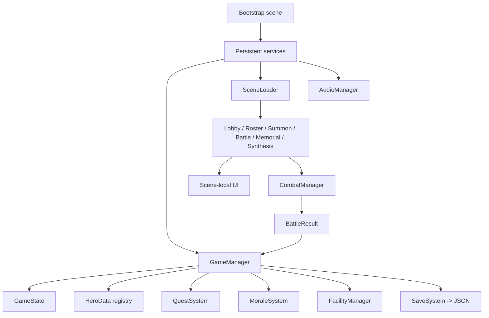
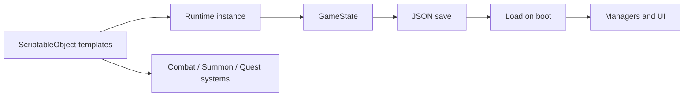

# PROJECT_MAP.md

## Purpose
This is the navigation map for agents. Use it to find the right system before opening code.

## Repo Overview
```text
/
|-- AGENTS.md
|-- MEMORY.md
|-- PROJECT_MAP.md
|-- CURRENT_TASK.md
|-- BUGS.md
|-- TODO.md
|-- CHANGELOG.md
|-- Docs/
|   |-- HERO_SYSTEM.md
|   |-- COMBAT_SYSTEM.md
|   |-- SUMMON_SYSTEM.md
|   |-- UI_SYSTEM.md
|   |-- SAVE_SYSTEM.md
|   |-- INVENTORY_SYSTEM.md
|   |-- SKILL_SYSTEM.md
|   |-- DATA_PIPELINE.md
|   |-- SCRIPT_HEADER_TEMPLATE.md
|   `-- QWEN_CODEBASE_AUDIT_PROMPT.md
|-- Assets/
|   |-- AGENTS.md
|   |-- Editor/
|   |-- Prefabs/
|   |   `-- UI/
|   |-- Resources/
|   |   |-- Heroes/
|   |   |-- Enemies/
|   |   `-- Floors/
|   |-- Scenes/
|   |-- Scripts/
|   |   |-- AGENTS.md
|   |   |-- Combat/
|   |   |   `-- AGENTS.md
|   |   `-- UI/
|   |       `-- AGENTS.md
|   `-- Settings/
|-- src/
`-- ui-prototype/
```

## System Hierarchy
- Core runtime
  - `GameManager`
  - `SaveSystem`
  - `SceneLoader`
  - `AudioManager`
- Player progression
  - `HeroData`
  - `HeroInstance`
  - `HeroDatabase`
  - `HeroUtils`
  - `MoraleSystem`
  - `QuestSystem`
  - `FacilityManager`
- Battle
  - `CombatManager`
  - `CombatSkillEvaluator`
  - `TraitSystem`
  - `TowerFloor`
  - `EnemyData`
  - `BattleResult`
  - `CombatUnit`
- Summoning
  - `GachaSystem`
  - `SummonUI`
  - `HeroCardUI`
  - `GachaCardFlip`
- UI
  - `LobbyUI`
  - `RosterUI` (runtime-generated hero cards + detail panel selection)
  - `BattleUI`
  - `MemorialUI`
  - `SynthesisUI`
  - `SquadFormationUI`
  - `FacilityUI`
  - `QuestUI`
  - `DetailPanelUI`

## Folder Hierarchy
- `Assets/Scenes`
  - `Bootstrap`
  - `Lobby`
  - `Roster`
  - `Summon`
  - `SquadFormation`
  - `Battle`
  - `Memorial`
  - `Synthesis`
- `Assets/Resources/Heroes`
  - `SO_Hero_*` assets
- `Assets/Resources/Enemies`
  - `SO_Enemy_*` assets
- `Assets/Resources/Floors`
  - `SO_Floor_*` assets
- `Assets/Prefabs/UI`
  - UI row, card, and battle unit prefabs
- `Assets/Editor`
  - generation and maintenance tools

## Runtime Architecture


## Data Flow


## Manager Relationships
- `GameManager` is the source of truth for roster, resources, squad, and save state
- `MoraleSystem`, `QuestSystem`, and `FacilityManager` live alongside `GameManager`
- `CombatManager` reads from `GameManager` and returns `BattleResult`
- `SceneLoader` changes scenes and is used by most UI entry points
- `AudioManager` listens to scene changes and exposes static SFX helpers

## Gameplay Lifecycle Overview
1. `Bootstrap` starts the persistent services
2. `GameManager` loads or creates `GameState`
3. `QuestSystem` restores quest state from save
4. Player moves through Lobby, Summon, Roster, Squad, and Synthesis scenes
5. A battle scene builds runtime combat units from current squad and floor data
6. Combat resolves into `BattleResult`
7. `GameManager`, `MoraleSystem`, and `QuestSystem` apply post-battle consequences
8. Save is written back to disk

## Files To Inspect First By Task Type
- Hero logic: `Assets/Scripts/HeroData.cs`, `Assets/Scripts/HeroInstance.cs`, `Docs/HERO_SYSTEM.md`
- Hero database: `Assets/Scripts/HeroDatabase.cs`, `Docs/HERO_SYSTEM.md`
- Combat logic: `Assets/Scripts/CombatManager.cs`, `Assets/Scripts/CombatSkillEvaluator.cs`, `Docs/COMBAT_SYSTEM.md`
- Summon logic: `Assets/Scripts/GachaSystem.cs`, `Assets/Scripts/UI/SummonUI.cs`, `Docs/SUMMON_SYSTEM.md`
- UI changes: the relevant UI script plus `Docs/UI_SYSTEM.md`
- Save changes: `Assets/Scripts/GameState_SaveSystem.cs`, `Docs/SAVE_SYSTEM.md`
- Skill changes: `Assets/Scripts/SkillData.cs`, `Assets/Scripts/SkillInstance.cs`, `Docs/SKILL_SYSTEM.md`
- Repo audit / external AI handoff: `Docs/QWEN_CODEBASE_AUDIT_PROMPT.md`, `AGENTS.md`, `PROJECT_MAP.md`
